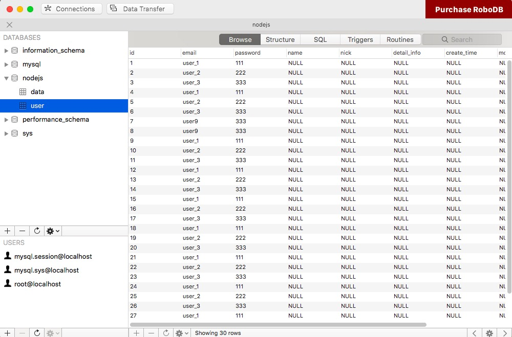

# node-mysql-package
mysql进阶学习，在node中封装mysql 启动初始化建表，后台检测 ，日志打印 ，提供数据库调用接口，方便使用   

## 如何使用本项目

```js
 clone:https://github.com/qiuChengleiy/node-mysql-package.git
 
 淘宝镜像命令安装（推荐-速度很快，安装项目依赖不用等太久）
 npm install -g cnpm --registry=https://registry.npm.taobao.org
 
 //安装依赖
 cnpm install
 
 //启动项目
 node app.js
 
 或者（我在package.json里配置了一个启动项，热编译node代码，可以实时刷新，错误检测,依赖supervisor插件）
 "hot": "./node_modules/.bin/supervisor app.js"
 cnpm run hot 
 
 在浏览器中查看 localhost:3000/  
 测试接口 “/koa2” 
 成功客户端会返回 数据库user用户表的所有信息 
 终端返回
 [demo] route-use-middleware 
 hello koa2 [demo] start-quick is starting at port 3000  O(∩_∩)O 
 [SUCCESS] sql脚本文件: data.sql 第1条脚本 执行成功 O(∩_∩)O !
 [SUCCESS] sql脚本文件: user.sql 第1条脚本 执行成功 O(∩_∩)O !
 [SUCCESS] sql脚本文件: user.sql 第2条脚本 执行成功 O(∩_∩)O !
 [SUCCESS] sql脚本文件: user.sql 第3条脚本 执行成功 O(∩_∩)O !
 [SUCCESS] sql脚本文件: user.sql 第4条脚本 执行成功 O(∩_∩)O !
 sql脚本执行结束！

 失败请检查路由中sql语句是否正确（注意：DROP TABLE user是否被注释掉，该句会删掉user表）
 确保mysql服务启动端口号是否正确（默认端口3306）
 
```

## 学习前环境准备
nodejs安装 参考：[ runoob ](http://www.runoob.com/nodejs/nodejs-mysql.html) -- 相信绝大多数的小伙伴学习node的时候都装好了

mysql安装 ：[ 下载地址 ](https://www.mysql.com/downloads/) （我用的是mac版）--其他-参考: [ 安装 ](http://www.runoob.com/mysql/mysql-install.html) 


### 安装mysql可能遇到的问题
服务启动和配置: [ 参考 ](https://jingyan.baidu.com/article/e6c8503c51ee97e54e1a186d.html) 

如果遇到这样的问题


终端输入：

```js
  1| $ sudo service mysqld stop
  
  2| $ cd /usr/bin
  
  3| $ sudo mysqld_safe --skip-grant-tables
  
  4| 打开另一个终端：（快捷键：command+t）
    1|$ mysql |不行的话 ./mysql
    
    2|mysql> use mysql;
    
    3|mysql> UPDATE user SET authentication_string=PASSWORD('输入你想要输入的密码') WHERE user = 'root';
    
    4|mysql> exit;
    
    5|sudo service mysqld start
    
    6|sudo mysqld_safe --skip-grant-tables
    
    7|mysql -u root -p
    
    输入你刚刚设置的密码出现下面，说明数据库成功开启 
    
        Welcome to the MySQL monitor.  Commands end with ; or \g.
        Your MySQL connection id is 137
        Server version: 5.7.21 MySQL Community Server (GPL)

        Copyright (c) 2000, 2018, Oracle and/or its affiliates. All rights reserved.

        Oracle is a registered trademark of Oracle Corporation and/or its
        affiliates. Other names may be trademarks of their respective
        owners.

        Type 'help;' or '\h' for help. Type '\c' to clear the current input statement.
        
        //查看服务端口号
        show global variables like 'port'; 
        //查看状态信息
        status; 
        //创建数据库“ 注意！！别忘了分号”；“
        create database nodejs; 
        //使用数据库
        use nodejs; 
        
       
```


### 环境配置的差不多了 这里介绍几个工具
mysql可视化工具： RoboDB Manager (APP Store有免费下载的 界面很简洁实用 )

RAP 是阿里开发人员开发的一款假数据生成平台,可以动态配置接口返回数据,使用mock语法随机生成数据 
[官网]（http://rapapi.org/org/index.do）
[文档]（https://github.com/thx/RAP/wiki/home_cn）

mockjs (生成随机数据，拦截 Ajax 请求): [文档](http://mockjs.com)


### 项目框架选择 （本项目用的是koa）
[koa2](https://koa.bootcss.com) (推荐) 个人觉得koa写起来比较优雅，如果用过express，上手也比较快

[express](http://www.expressjs.com.cn/4x/api.html)


### 项目结构分析
``` sh
├── app.js # 服务启动文件
├── node_modules/ #模块文件
├── routes/ #路由管理
├── static/ #静态文件存放
├── package.json #包文件信息
├── dataBase/ # 数据库
    ├── index.js   # 程序入口文件
    ├── mock.js   # mock模拟接口数据
    ├── sql   # sql脚本文件目录
    │   ├── goods.sql  #商品信息表
    │   └── user.sql  #用户信息列表
    └── util    # 工具集
        ├── db.js # 封装mysql模块---提供数据库接口方法 
        ├── getSqlContent.js # 获取sql脚本文件内容
        ├── getSql.js # 获取所有sql脚本文件
        └── ergodicFile.js # 遍历sql脚本文件
```

## 各部分文件介绍

### 服务启动文件 app.js
```js
//app.js
const Koa = require('koa');
const app = new Koa();
const Router = require('koa-router');

//后台模拟数据
const mockdb = require('./dataBase/mock')();

//引入数据库入口文件 - mysql;
const mysql = require('./dataBase/index')();


//对跨域的简单配置(前后台完全分离，用ajax请求)
//用通配符 * 可以实现所有跨域的请求
app.use(async (ctx, next) => {
 ctx.set('Access-Control-Allow-Origin', '*');
 ctx.set('Access-Control-Allow-Methods', 'PUT,DELETE,POST,GET');
 ctx.set('Access-Control-Max-Age', 3600 * 24);
 ctx.set('Access-Control-Allow-Credentials', true);
 await next();
});

//加载路由子模块
const router = require('./routes/router');
// 加载路由中间件
app.use(router.routes()).use(router.allowedMethods());

// service port
app.listen(3000, () => {
  console.log('[demo] route-use-middleware \n hello koa2 [demo] start-quick is starting at port 3000  O(∩_∩)O ');
});

//当使用supervisor监听node时，不需要在另外node app.js启动了
//[package.json] "hot": "./node_modules/.bin/supervisor app.js"

```
### 路由设计 ./routes
```js
//router.js
//引入模块
const Koa = require('koa');
const app = new Koa();
const Router = require('koa-router');
let home = new Router();


//调用数据库接口
const { query } = require('../dataBase/util/db');


// 子路由1
home.get('/', async ( ctx )=>{
  let html = `
    <ul>
      <li><a href="/childs/helloworld">/childs/helloworld</a></li>
      <li><a href="/childs/404">/childs/404</a></li>
    </ul>
  `
  ctx.body = html;
}).get('koa2', async ( ctx ) => {
    //在路由中调用数据库接口 进行数据库操作；

    const users = {
     	name: 'node-mysql',
     	password: '123'
     };
   
   //查询 | 插入
    let sql = 'SELECT * FROM user';
    let addData = "INSERT INTO user( name, password ) VALUES( ?,? )";
    
    //使用接口
    let datas = await query(sql);
    let adds = await query(addData,[users.name,users.password]);
    
    //删除表 (清空所有内容）
    let deletes = await query("DROP TABLE user");
    
    //返回给客户端
    ctx.body = datas;
    console.log('sql is using...');
});


// 子路由2
let routeChilds = new Router();
page.get('/404', async ( ctx )=>{
  ctx.body = '404 page!'
}).get('/helloworld', async ( ctx )=>{
  ctx.body = 'helloworld page!'
});


// 装载所有子路由 | /404 是嵌套在/childs下的 /childs/404
let router = new Router();
router.use('/', home.routes(), home.allowedMethods());
router.use('/childs', routeChilds.routes(), routeChilds.allowedMethods());

module.exports = router;

```

### 数据模拟 ./dataBase/mock.js
```js
//数据模拟 这里模仿list下id为1-10递增 其他相关API看官网文档（前边已经贴出）
module.exports = () => {
var Mock = require('mockjs');
var data = Mock.mock({
    'list|1-10': [{
        'id|+1': 1
    }]
});
console.log(JSON.stringify(data, null, 4));
};

```

### 数据库操作文件 ./util/db.js
```js
//引入模块
const mysql = require('mysql');

//创建链接池 注意host-(localshot如果出错的话用127.0.0.1)
const pool = mysql.createPool({
	host: '127.0.0.1',
	user: 'root',
	password: 'root',
	port: '3306',
	database: 'nodejs'
});

//数据库操作接口封装
let query = function( sql, value ) {
	return new Promise(( resolve, reject ) => {
		pool.getConnection(function( err, connection ) {
			if( err ) {
				reject( err )
			} else {
				connection.query( sql, value, ( err, rows ) => {
					if ( err ) {
						reject( err )
					} else {
						resolve( rows )
					}
				});
			}
		})
	})
};

module.exports = {
	query
};
```

### 获取所有sql脚本内容 ../util/getSqlContent.js
```js
const fs = require('fs');
const getSqlMap = require('./getSql');

let sqlContentMap = {};

/**
 * 读取sql文件内容
 *  fileName     文件名称
 *  path         文件所在的路径
 *  {string}    脚本文件内容
 */
function getSqlContent( fileName,  path ) {
  let content = fs.readFileSync( path, 'binary' );
  sqlContentMap[ fileName ] = content;
};

/**
 * 封装所有sql文件脚本内容
 * @return object
 */
 
function getSqlContentMap () {
  let sqlMap = getSqlMap();
  for( let key in sqlMap ) {
    getSqlContent( key, sqlMap[key] );
  };

  return sqlContentMap;
};

module.exports = getSqlContentMap;
```

### 获取sql目录详情 ../util/getSql.js
```js
const fs = require('fs');
const ergodicFile = require('./ergodicFile');

/**
 * 获取sql目录下的文件目录数据
 * @return object
 */
function getSqlMap () {
  let basePath = __dirname;
  basePath = basePath.replace(/\\/g, '\/');

  let pathArr = basePath.split('\/');
  pathArr = pathArr.splice( 0, pathArr.length - 1 );
  basePath = pathArr.join('/') + '/sql/';

  let fileList = ergodicFile( basePath, 'sql' );
  return fileList;
};

module.exports = getSqlMap;
```

### 遍历目录操作 ../util/ergodicFile.js
```js
const fs = require('fs');

/**
 * 遍历目录下的文件目录
 * @param   pathResolve         需进行遍历的目录路径
 * @param   mime                遍历文件的后缀名
 * @return  object              返回遍历后的目录结果
 */

//遍历目录下的文件
const ergodicFile = function ( pathResolve, mime ){
	let files = fs.readdirSync ( pathResolve );
	let fileList = {};

	for( let [ i, item] of files.entries() ) {
		let itemArr = item.split('\.');

	    let itemMime = ( itemArr.length > 1 ) ? itemArr[ itemArr.length - 1 ] : 'undefined'
	    let keyName = item + ''
	    if( mime === itemMime ) {
	      fileList[ item ] =  pathResolve + item;
	   };
	 };
	 return fileList; 
};

module.exports = ergodicFile;
```

### 入口文件 ./index.js
```js

const fs = require('fs');
const getSqlContentMap = require('./util/getSqlContent');
const { query } = require('./util/db');


// 打印脚本执行日志
const eventLog = function( err , sqlFile, index ) {
  if( err ) {
    console.log(`[ERROR] sql脚本文件: ${sqlFile} 第${index + 1}条脚本 执行失败 o(╯□╰)o ！`)
  } else {
    console.log(`[SUCCESS] sql脚本文件: ${sqlFile} 第${index + 1}条脚本 执行成功 O(∩_∩)O !`)
  }
}

// 获取所有sql脚本内容
let sqlContentMap = getSqlContentMap()；

// 执行建表sql脚本
const createAllTables = async () => {
  for( let key in sqlContentMap ) {
    let sqlShell = sqlContentMap[key]
    let sqlShellList = sqlShell.split(';')；

    for ( let [ i, shell ] of sqlShellList.entries() ) {
      if ( shell.trim() ) {
        let result = await query( shell )；
        if ( result.serverStatus * 1 === 2 ) {
        if ( result.serverStatus * 1 === 2 ) {
          eventLog( null,  key, i)；
        } else {
          eventLog( true,  key, i)； 
        }
      }
    }
  }；
  console.log('sql脚本执行结束！')；
  console.log('请按 ctrl + c 键退出！')；

}；

module.exports = createAllTables;
```

### sql脚本文件 ./sql/goods.sql
```sql
CREATE TABLE   IF NOT EXISTS  `data` (
  `id` int(11) NOT NULL AUTO_INCREMENT,
  `name` json DEFAULT NULL,
  `price` varchar(20) DEFAULT NULL,
  `time` varchar(20) DEFAULT NULL,
  `desciption` int(11) DEFAULT NULL,
  PRIMARY KEY (`id`)
) ENGINE=InnoDB DEFAULT CHARSET=utf8;
```

### sql脚本文件 ./sql/user.sql
```sql
CREATE TABLE   IF NOT EXISTS  `user` (
  `id` int(11) NOT NULL AUTO_INCREMENT,
  `email` varchar(255) DEFAULT NULL,
  `password` varchar(255) DEFAULT NULL,
  `name` varchar(255) DEFAULT NULL,
  `age` varchar(255) DEFAULT NULL,
  `detail_info` json DEFAULT NULL,
  `love` varchar(20) DEFAULT NULL,
  `sex` varchar(20) DEFAULT NULL,
  `degree` int(11) DEFAULT NULL,
  PRIMARY KEY (`id`)
) ENGINE=InnoDB DEFAULT CHARSET=utf8;

INSERT INTO `user` set email='xiaoming', password='123';
INSERT INTO `user` set email='xiaohong', password='123';
INSERT INTO `user` set email='xiaobing', password='123';

```


## 效果

### 执行脚本
```
node server.js

或者

cnpm run hot

```

### 最终显示
#### 浏览器下显示


#### 查看数据库写入数据 （可视化工具）


#### 终端显示


### 相关资源分享
mysql sql语句大全（很全） ： [前往](http://www.cnblogs.com/yunf/archive/2011/04/12/2013448.html)
node-mysql( cnpm i --save-dev node-mysql ) [文档](https://www.npmjs.com/package/node-mysql)（只找到英文的-。-）

### 参考文献
[node-mysql官方技术文档翻译-开源中国社区](https://www.oschina.net/translate/node-mysql-tutorial)
[es2017 新特性：async functions(异步函数)](http://www.css88.com/archives/7731)
[koa2进阶学习](https://chenshenhai.github.io/koa2-note/)

### 如有错误 欢迎指正
qq:1421546334
email:qcl9701s666@163.com

### 敢于尝试的你 其实你已经进步了 

#(^-^)


